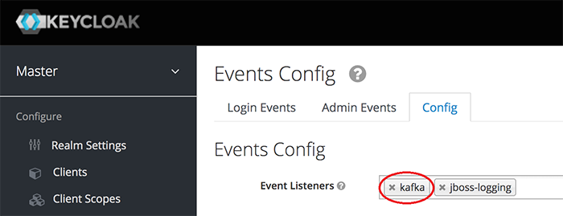

# Keycloak Kafka Module
Simple module for [Keycloak](https://www.keycloak.org/) to produce keycloak events to [Kafka](https://kafka.apache.org/).

- [Keycloak Kafka Module](#keycloak-kafka-module)
  * [Build](#build)
  * [Installation](#installation)
  * [Module Configuration](#module-configuration)
    + [Kafka client configuration](#kafka-client-configuration)
    + [Kafka client using secure connection](#kafka-client-using-secure-connection)
  * [Module Deployment](#module-deployment)
  * [Keycloak Configuration](#keycloak-configuration)
     + [Enable Events in keycloak](#enable-events-in-keycloak)
  * [Docker Container](#docker-container)  
  * [Sample Client](#sample-client)

**Tested with** 

Kafka version: `2.12-2.1.x`, `2.12-2.4.x`, `2.12-2.5.x`, `2.13-2.8`, `2.13-3.3.x`

Keycloak version: `19.0.x, 21.0.x`

Java version: `17`

Check out [this older version](https://github.com/SnuK87/keycloak-kafka/tree/1.1.1) to run the module on a Wildfly server


## Build
You can simply use Maven to build the jar file. Thanks to the assembly plugin the build process will create a fat jar that includes all dependencies and makes the deployment quite easy.
Just use the following command to build the jar file.

```bash
mvn clean package
```

## Installation
First you need to build or [download](https://github.com/SnuK87/keycloak-kafka/releases) the keycloak-kafka module.

To install the module to your keycloak server you have to configure the module and deploy it.
If you deploy the module without configuration, your keycloak server will fail to start throwing a `NullPointerException`.

If you want to install the module manually as described in the initial version you can follow this [guide](https://github.com/SnuK87/keycloak-kafka/wiki/Manual-Installation).

## Module Configuration
The following properties can be set via environment variables (e.g. `${KAFKA_TOPIC}`) or as parameters when starting keycloak (e.g. `--spi-events-listener-kafka-topic-events`).

- `topicEvents` (env `KAFKA_TOPIC`): The name of the kafka topic to where the events will be produced to.

- `clientId` (env `KAFKA_CLIENT_ID`): The `client.id` used to identify the client in kafka.

- `bootstrapServers` (env `KAFKA_BOOTSTRAP_SERVERS`): A comma separated list of available brokers.

- `events` (env `KAFKA_EVENTS`): The events that will be send to kafka.

- `topicAdminEvents` (env `KAFKA_ADMIN_TOPIC`): (Optional) The name of the kafka topic to where the admin events will be produced to. No events will be produced when this property isn't set.

A list of available events can be found [here](https://www.keycloak.org/docs/latest/server_admin/#event-types)

###  Kafka client configuration
It's also possible to configure the kafka client with environment variables or by adding parameters to the keycloak start command. This makes it possible to connect this module to a kafka broker that requires SSL/TLS connections.
For example to change the timeout of how long the producer will block the thread to 10 seconds you just have to pass the following parameter to the start command.

```sh
./kc.sh start --spi-events-listener-kafka-max-block-ms 10000
```

Or set the following environnment variable.

```sh
KAFKA_MAX_BLOCK_MS=10000
```

A full list of available configurations can be found in the [official kafka docs](https://kafka.apache.org/documentation/#producerconfigs).

### Kafka client using secure connection
As mentioned above the kafka client can be configured by passing parameters to the start command. To make kafka open a SSL/TLS secured connection you can add the following parameters:

```
./kc.sh start \
  --spi-events-listener-kafka-security-protocol SSL \
  --spi-events-listener-kafka-ssl-truststore-location kafka.client.truststore.jks \
  --spi-events-listener-kafka-ssl-truststore-password test1234
```

## Module Deployment
Copy the `keycloak-kafka-<version>-jar-with-dependencies.jar` into the `$KEYCLOAK_HOME/providers` folder. Keycloak will automatically 
install the module with all it's dependencies on start up.


## Keycloak Configuration

### Enable Events in keycloak
1. Open administration console
2. Choose realm
3. Go to Events
4. Open `Config` tab and add `kafka` to Event Listeners.



## Docker Container
The simplest way to enable the kafka module in a docker container is to create a custom docker image from the keycloak base image. A simple example can be found in the [Dockerfile](Dockerfile).
When you build this image on your local machine by using `docker build . -t keycloak-kafka`, you can test everything by running the [docker-compose](docker-compose.yml) file on your local machine. 
This just provides a simple example to show how it's working. Please consider to read [this documentation](https://www.keycloak.org/server/containers) and create your own Dockerfile.

## Sample Client

The following snippet shows a minimal Spring Boot Kafka client to consume keycloak events. Additional properties can be added to the `KeycloakEvent` class.

```java
@SpringBootApplication
@Log4j2
public class KafkaConsumerApplication {

	public static void main(String[] args) {
		SpringApplication.run(KafkaConsumerApplication.class, args);
	}

	@KafkaListener(topics = "keycloak-events", groupId = "event-consumer")
	public void handleKeycloakEvent(KeycloakEvent event) {
		log.info("Consumed event: " + event);
	}

	@KafkaListener(topics = "keycloak-admin-events", groupId = "event-consumer")
	public void handleKeycloakAdminEvent(KeycloakAdminEvent event) {
		log.info("Consumed admin event: " + event);
	}

	@Bean
	public StringJsonMessageConverter jsonConverter() {
		return new StringJsonMessageConverter();
	}
}

@Data
class KeycloakEvent {
	private String userId;
	private String type;
}

@Data
class KeycloakAdminEvent {
	private String realmId;
	private String operationType;
}
```

## Contribution

Any kind of contributions are welcome.
