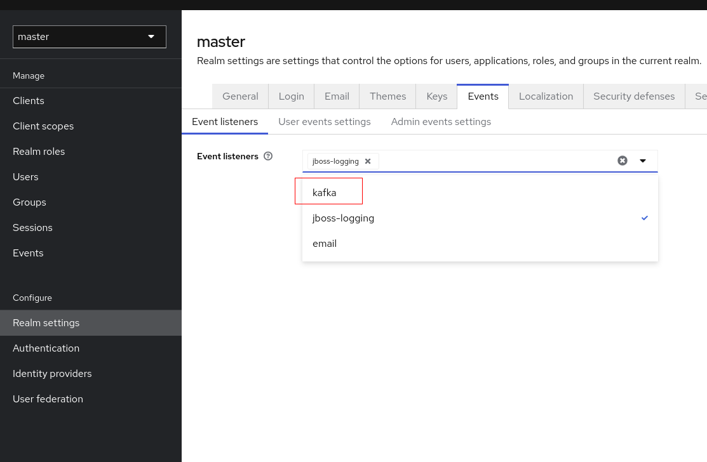

## Antiope

Antiope is a Keycloak extension that provides Kafka event listener capabilities. It allows Keycloak to publish various user-related events to a Kafka topic, enabling real-time data processing and integration with other systems.



### Requirements

Prerequisites

-Java 11 or higher
-Maven 3.6 or higher
-A running instance of Keycloak
-Apache Kafka

### Build

You can simply use Maven to build the jar file. Thanks to the assembly plugin the build process will create a fat jar that includes all dependencies and makes the deployment quite easy.
Just use the following command to build the jar file.

```bash
mvn clean package
```

## Installation
To install the module to your keycloak server you have to configure the module and deploy it.

### Builder image

To run the image locally, follow these steps:

1. Navigate to the directory where the builder.dockerfile is located:

- `cd path/to/your/builder/directory .`
  
2. Build the Docker image with the name antiope using the keycloak.dockerfile file:

- Build the keycloak image.
  - `docker build -t antiope -f keycloak.dockerfile .`

3. Start the Keycloak server using Docker Compose:
   - `docker compose up keycloak`

### Ci image

Stuff needed to be done to change the ci docker image.

- Build the ci image.
  - `docker build -t inowattio/antiope:ci -f ci.dockerfile .`
- Push the new image.
  - `docker push inowattio/antiope:ci`

## Module Deployment
Copy the `antiope-jar-with-dependencies.jar` into the `$KEYCLOAK_HOME/providers` folder. Keycloak will automatically 
install the module with all it's dependencies on start up.

## Module Configuration

The configuration for the Antiope module is encoded in Base64 and passed as an environment variable. The configuration contains details about the realms, Kafka brokers, and topics. Below is an example of the configuration:

	[
	  { 
	    "realmName": "realm1",
	    "brokerIp": "kafka",
	    "brokerPort": "9092",
	    "topic": "topic1",
	    "clientId": "client1"
	  },
	  { 
	    "realmName": "realm2",
	    "brokerIp": "kafka",
	    "brokerPort": "9092",
	    "topic": "topic2",
	    "clientId": "client2"
	  }
	]
	
Replace the ANTIOPE_CONFIG value in your Docker Compose or environment configuration accordingly.

